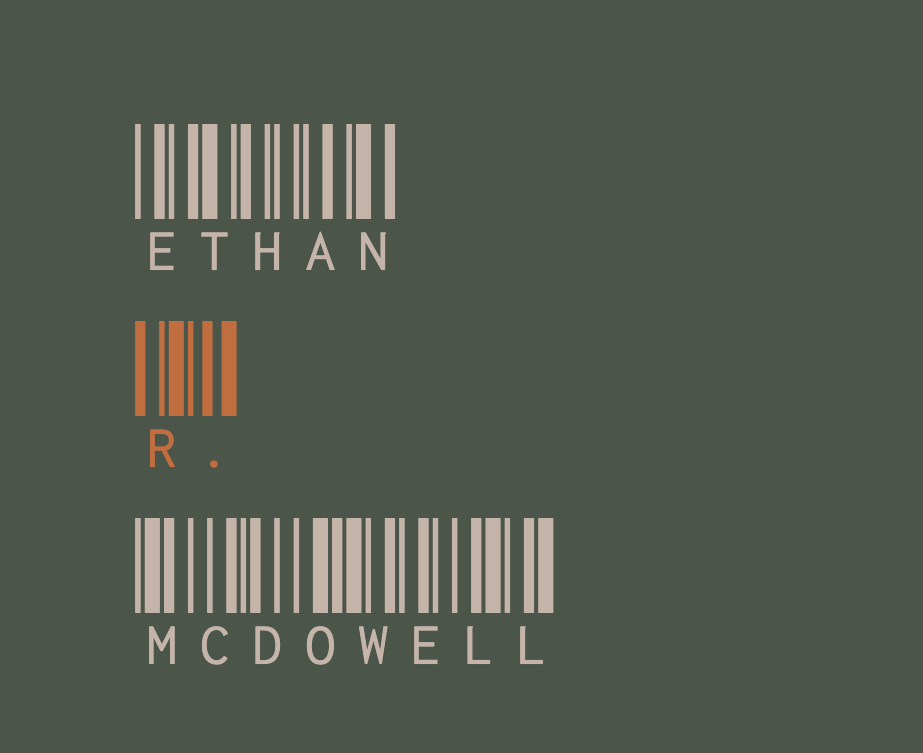

# ethanrmcdowell.github.io

<a href="https://ethanrmcdowell.github.io">Link to deployed site</a>

The goals of this assignment were to create a functional portfolio for us to continue to use throughout the course. We were to have three pages: out home (index.html), a portfolio page, and a contact page. The entire site is to be responsive to screen size, so the images on my home page will go to separate lines when on a small screen and the cards containing information on the portfolio page will go down to 2/row on a smaller screen, and 1/row on mobile screens.

Upon updating my portfolio, pictures of completed applications as well as links to five of them have been added. Another link has been added to the nav bar sending users to a copy of my resume.
